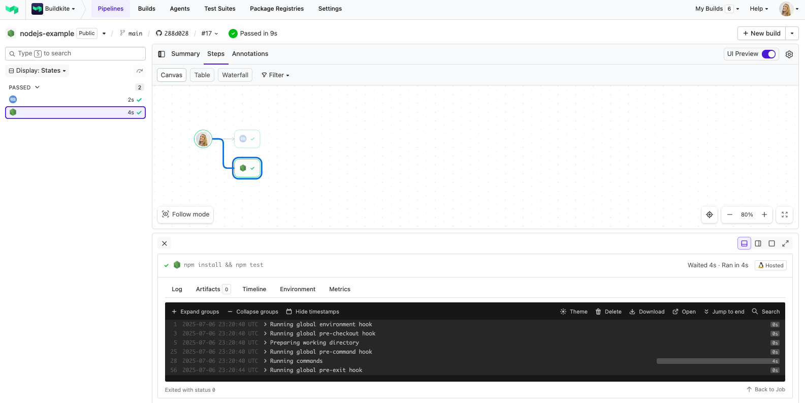

# Buildkite Node.js Example

This repository is an example [Buildkite](https://buildkite.com/) pipeline that runs tests for a [Node.js](https://nodejs.org/) project.

👉 **See this example in action:** [buildkite/nodejs-example](https://buildkite.com/buildkite/nodejs-example/builds/latest?branch=main)

<!-- docs:start -->

## How it works

This example:
- Runs `npm install` and `npm test` using Node.js
- Assumes Node.js is already available on the agent machine

> 💡 If you prefer to use Docker instead of installing Node.js directly, check out the [Node.js Docker Example](https://github.com/buildkite/nodejs-docker-example).

<!-- docs:end -->

## License

See [LICENSE.md](LICENSE.md) (MIT)
